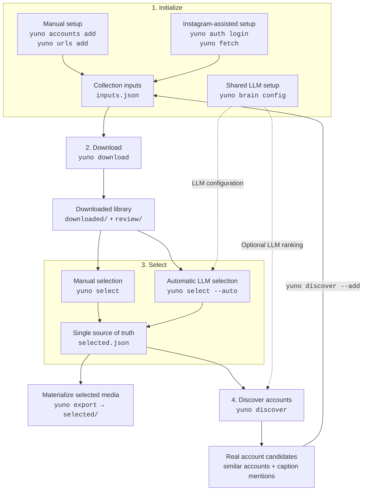

# yunoballizer

A personal CLI for collecting and selecting content from Instagram, YouTube
Shorts, and TikTok.

## Core workflow



Manual account entry and authenticated `fetch` are equal initialization paths;
use either or both. `fetch` only updates account lists. Downloads are anonymous.

## Install

```bash
pip install -e .
# once published:
pip install yunoballizer
```

Both `yunoballizer` and `yuno` are installed as commands.

## First-time setup

Workflow commands create `inputs.json` as needed:

```json
{
  "instagram": ["nasa", "natgeo"],
  "youtube": ["nasa"],
  "tiktok": ["nasa"],
  "urls": ["https://www.instagram.com/p/ABC123/"]
}
```

Account values are lowercase IDs without `@` on every platform. URLs remain
full HTTP(S) URLs. Downloads do not require login.

Edit it directly or use `yuno accounts`, `yuno urls`, and `yuno fetch`.
Configure one shared LLM profile with `yuno brain config` for `select --auto`,
`discover`, and `larp`.

## Usage

### Collection inputs

```bash
yuno accounts list
yuno accounts list instagram
yuno accounts add instagram nasa
yuno accounts remove instagram nasa

yuno urls list
yuno urls add https://example.com/post
yuno urls remove https://example.com/post
```

`yuno urls add` persists a URL in `inputs.json`; `yuno download <URL>` downloads it
once without saving it.

### Instagram session and fetch

```bash
yuno auth login               # Open the default Chrome login window
yuno auth login -b edge       # Use Edge
yuno auth login -b firefox    # Import the active Firefox session
yuno auth login -y            # Skip save confirmation
yuno auth status              # List sessions; * marks the active one
yuno auth status -c           # Also verify each session
yuno auth switch <user>       # Switch the session used by fetch
yuno auth switch              # Cycle to the next session
yuno auth logout [<user>...]  # Remove sessions; defaults to the active one

yuno fetch                    # Add saved-post authors to inputs.json
```

`auth login` stores Instagram session cookies, never passwords. Session files
use `0600` permissions and their directory uses `0700`. `fetch` uses the active
session and downloads no media.

### Download

```bash
yuno download
yuno download @nasa
yuno download https://www.instagram.com/p/ABC123/

yuno download -l 5
yuno download -s 5 -l 10
yuno download -p instagram
yuno download --since 2026-01-01
yuno download --until 2026-06-30
yuno download -t photo
yuno download --total-limit 50
yuno download --delay 5
```

A bare `yuno download` reads every list in `inputs.json`. `--skip` skips
the newest posts per account; `--limit` caps what follows. `review/` is refreshed
as downloads finish, so completed items remain browsable after interruption.

### Selection and export

```bash
yuno select               # Manual picker
yuno select --auto        # LLM selection from manual history
yuno select --auto -l 5   # Judge at most five new posts
yuno export               # Materialize selected files into selected/
```

Both modes write to `selected.json`:

- `s` records a manual `selected` decision.
- `d` records a manual `rejected` decision.
- Untouched items remain undecided.
- `select --auto` uses captioned manual selections and rejections as positive
  and negative examples.
- Automatic selections never override manual selections or become new taste
  examples.

Automatic selection requires `yuno brain config`. Selection is made per post,
so every item in a carousel receives the same result.

`review/` is a disposable symlink index. Selection state lives only in
`selected.json`; `yuno export` creates real files in `selected/` using
hardlinks where possible and copies otherwise.

Picker keys:

| Key | Action |
|---|---|
| `←` / `→` | Move |
| `s` / `d` | Select / reject |
| `c` | Save the caption as a larp template |
| `Ctrl-s` / `Ctrl-d` | Add / remove the item's account |
| `o` | Open with the OS viewer |
| `Enter` / `q` | Finish |

Image previews use `viu`. Video frame previews additionally use optional
`ffmpeg`; without it, videos show a placeholder.

### Account discovery

```bash
yuno discover          # Preview candidates
yuno discover -l 5     # Show at most five
yuno discover --add    # Add results to inputs.json
```

`discover` starts from selected Instagram posts and merges two candidate
sources:

- `@mentions` found in selected captions
- Instaloader similar accounts for selected-post authors

Similar-account lookup needs an active `yuno auth` session. Without one, only
caption mentions are used. Existing seeds and monitored accounts are excluded.

With an LLM profile, the model chooses only from collected candidates using
selected captions and candidate metadata. Without one, candidates are ranked by
mention count and similar-account evidence. The default is preview-only.

> **TODO:** Add an option to choose `mentions`, `similar`, or both discovery
> sources. Currently both run whenever similar-account lookup is available.
>
> **TODO:** Add an interactive termui review so candidates can be inspected and
> selected individually before they are added. Currently preview mode only
> prints the ranked list.

### Brain profiles

```bash
yuno brain config groq
yuno brain
yuno brain list
yuno brain switch <name>
yuno brain remove <name>
```

Profiles contain an API key, model, and optional OpenAI-compatible chat
completions endpoint. Groq is the default; OpenRouter, Together AI, Fireworks,
vLLM, and LM Studio can use custom endpoints. Different API formats are not
supported.

Profiles live under `$CONFIG_DIR/brain/profiles/` with `0600` permissions.
Environment variables remain available for scripts:

```bash
YUNOBALLIZER_API_KEY=gsk_...
YUNOBALLIZER_MODEL=llama-3.1-8b-instant
YUNOBALLIZER_API_BASE=https://api.example.com/v1/chat/completions
```

Priority: command flags, environment variables or `$CONFIG_DIR/.env`, active
brain profile, then built-in defaults.

### Larp templates and generation

```bash
yuno larp add casual "오늘도 열심히 달렸다 #daily #run"
yuno larp list
yuno larp list casual
yuno larp remove casual 0
yuno larp rename casual laid-back
yuno larp delete laid-back

yuno larp --style casual
yuno larp --style casual -n 5
yuno larp --style casual --language English
yuno larp --model llama-3.1-8b-instant
yuno larp --max-tokens 1500
```

Templates are grouped by style under `$CONFIG_DIR/larp/styles/`. The picker’s
`c` key saves the current downloaded caption to a chosen style without changing
its selection state. `--style` may be omitted when only one style exists.

## Data locations

| Kind | Priority order |
|---|---|
| Data | `$YUNOBALLIZER_DATA_DIR`, `$XDG_DATA_HOME/yunoballizer`, `~/.local/share/yunoballizer` |
| Config | `$XDG_CONFIG_HOME/yunoballizer`, `~/.config/yunoballizer` |
| State | `$XDG_STATE_HOME/yunoballizer`, `~/.local/state/yunoballizer` |

Paths supplied through these variables must be absolute.

```text
~/.local/share/yunoballizer/
├── downloaded/
│   ├── instagram/<account>/<post-id>/
│   ├── youtube/<account>/<video-id>/
│   ├── tiktok/<account>/<post-id>/
│   └── other/<extractor>/<uploader>/<post-id>/
├── review/               # symlink index into downloaded/
└── selected/             # exported real files

~/.local/state/yunoballizer/
└── archives/             # yt-dlp deduplication state

~/.config/yunoballizer/
├── inputs.json           # Instagram/YouTube/TikTok IDs + URLs
├── selected.json         # manual/automatic selections
├── sessions/
│   ├── active
│   └── <username>.session
├── larp/styles/
├── brain/profiles/
│   ├── active
│   └── <name>.json
└── .env                  # optional LLM environment configuration
```

`downloaded/` is the media source of truth. Each post directory contains its
media, caption, and metadata. `review/` can be deleted and regenerated without
affecting downloaded files.

## Uninstalling

```bash
yuno prune                # Remove this app's config, data, and state
pip uninstall yunoballizer
```

`yuno prune` asks for confirmation unless `-y`/`--yes` is provided. It does not
uninstall the Python package.

## Notes

- Instagram post URLs use Instaloader; other individual URLs use yt-dlp.
- TikTok hashtag/trending discovery is not supported.
- Aggressive downloading can trigger temporary IP blocks.
- Instagram prohibits automated collection in its Terms of Service.
- Keep copyright and redistribution restrictions in mind.
